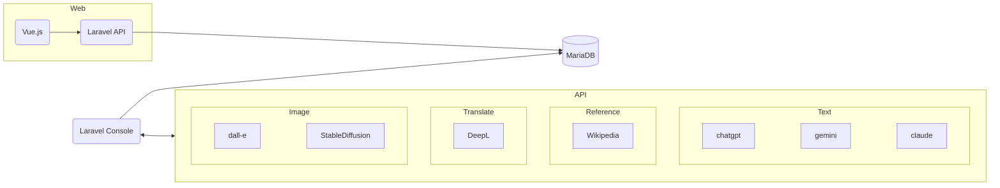
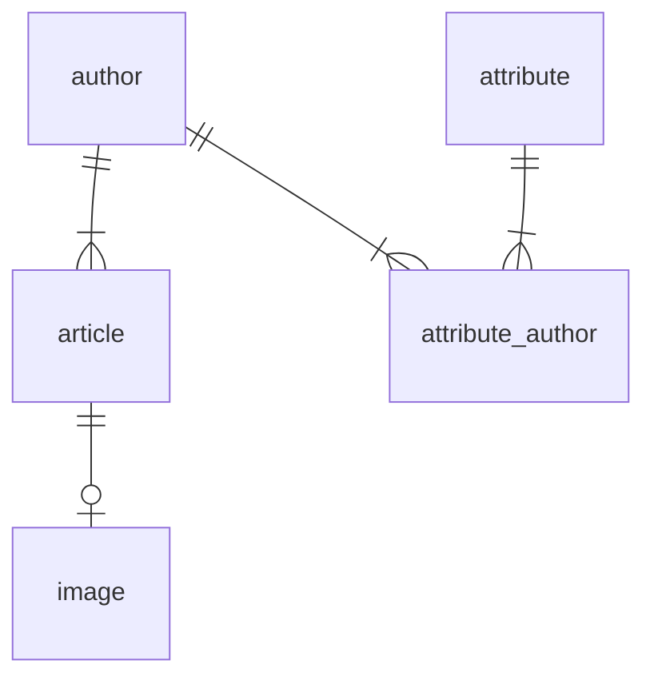

# AI-rticle

## 概要

AIを駆使したブログ記事自動生成サイトです。  
Laravel + Vue.jsで作成しています。  
日本語プロンプトで日本語・英語の文章を書かせており、
現時点で日本語の入力と出力両方に優れたLLMを選んでます。

https://ja.ai-rticle.site/  
https://en.ai-rticle.site/

## 特徴
- gpt-3.5-turbo, gemini-pro, claude-instant1.2の3種類のLLMを使用
- 日本語と英語、2種類の記事を生成
- dalleとStable Diffusionによる記事の挿絵画像生成
- 翻訳にはDeepLのAPIを使用
- レスポンシブデザインのSPA
- LaravelとVue.jsはhal+jsonを介してAPI連携
- RSS自動生成

## システム構成  
### 開発環境
- Docker Desktop 4.12.0
- Ubuntu 22.04.3 LTS（Windows 11 WSL上）
- PHP 8.3.2
    - Laravel 10.43.0
        - Laravel Vite 1.0.1
- NodeJs 18.19.0
    - vite 5.1.3
        - vitejs/plugin-vue 5.0.4
    - vue-router 4.3.0
    - bootstrap 5.3.3
    - sass 1.71.1
    - axios 1.6.7
- MariaDB 11.2.2

### 構成概要

## データベース

### ER図

テーブル定義

### 著者: authors
| 列名       | データ型     | 制約           | 説明         |
|------------|--------------|----------------|--------------|
| id         | INT          | PK             | 著者ID   |
| name       | VARCHAR(255) | UK, NOT NULL |著者名 |
| created_at | timestamp    | DEFAULT current_timestamp   | 作成日時     |
| updated_at | timestamp    | DEFAULT NULL   | 更新日時     |
| deleted_at | timestamp    | DEFAULT NULL   | 削除日時     |

### 記事: articles
| 列名       | データ型     | 制約           | 説明         |
|------------|--------------|----------------|--------------|
| id         | INT          | PK             | 記事ID   |
| author_id  | INT          | FK,NOT NULL       |著者ID        |
| title      | VARCHAR(255) |               | タイトル |
| content    | text         | NOT NULL       | 本文  |
| locale     | VARCHAR(255) | NOT NULL       |言語名 |
| llm_name   | VARCHAR(255) | NOT NULL       |言語生成モデル名 |
| created_at | timestamp    | DEFAULT current_timestamp   | 作成日時     |
| updated_at | timestamp    | DEFAULT NULL   | 更新日時     |
| deleted_at | timestamp    | DEFAULT NULL   | 削除日時     |

### 記事: images
| 列名       | データ型     | 制約           | 説明         |
|------------|--------------|----------------|--------------|
| id         | INT          | PK             | 記事ID   |
| article_id  | INT          | FK,NOT NULL       |著者ID        |
| path | VARCHAR(255) | NOT NULL       |画像URLパス |
| model_name   | VARCHAR(255) | NOT NULL       |生成モデル名 |
| created_at | timestamp    | DEFAULT current_timestamp   | 作成日時     |
| updated_at | timestamp    | DEFAULT NULL   | 更新日時     |

### 属性: attributes
| 列名       | データ型     | 制約           | 説明         |
|------------|--------------|----------------|--------------|
| id         | INT          | PK             | 属性ID   |
| name       | VARCHAR(255) | UK, NOT NULL   |属性名 |
| type       | VARCHAR(255) | NOT NULL       |分類 |
| created_at | timestamp    | DEFAULT current_timestamp   | 作成日時     |
| updated_at | timestamp    | DEFAULT NULL   | 更新日時     |

### 属性_著者_中間: attribute_author

| 列名       | データ型     | 制約           | 説明         |
|------------|--------------|----------------|--------------|
| attribute_id    | INT         | FK             | 属性ID       |
| author_id     | INT          | FK             | 著者ID       |

## ライセンス

このプロジェクトは[MITライセンス](LICENSE)の下でライセンスされています。
