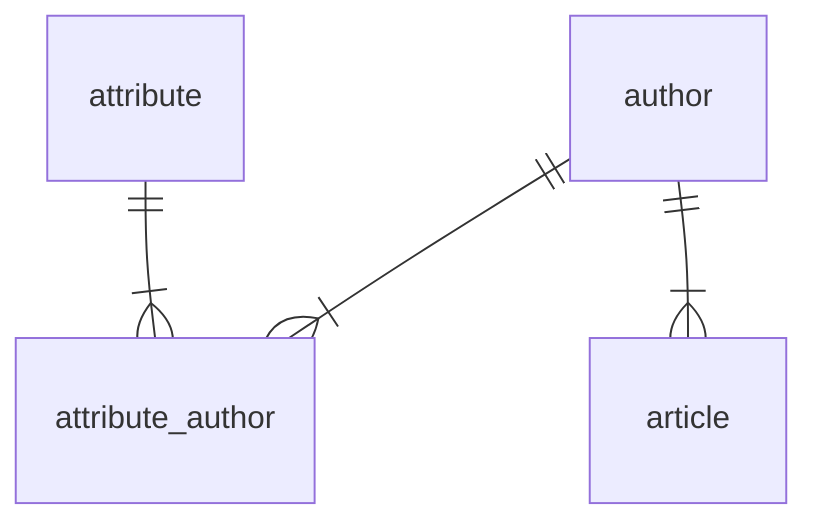

# AIブロガーサイト

## データベース

### ER図

テーブル定義

### 著者: authors
| 列名       | データ型     | 制約           | 説明         |
|------------|--------------|----------------|--------------|
| id         | INT          | PK             | 著者ID   |
| name       | VARCHAR(255) | UK, NOT NULL |著者名 |
| created_at | timestamp    | DEFAULT current_timestamp   | 作成日時     |
| updated_at | timestamp    | DEFAULT NULL   | 更新日時     |
| deleted_at | timestamp    | DEFAULT NULL   | 削除日時     |

### 記事: articles
| 列名       | データ型     | 制約           | 説明         |
|------------|--------------|----------------|--------------|
| id         | INT          | PK             | 記事ID   |
| author_id  | INT          | FK,NOT NULL       |著者ID        |
| title      | VARCHAR(255) |               | タイトル |
| content    | text         | NOT NULL       | 本文  |
| locale     | VARCHAR(255) | NOT NULL       |言語名 |
| llm_name   | VARCHAR(255) | NOT NULL       |言語生成モデル名 |
| created_at | timestamp    | DEFAULT current_timestamp   | 作成日時     |
| updated_at | timestamp    | DEFAULT NULL   | 更新日時     |
| deleted_at | timestamp    | DEFAULT NULL   | 削除日時     |

### 属性: attributes
| 列名       | データ型     | 制約           | 説明         |
|------------|--------------|----------------|--------------|
| id         | INT          | PK             | 属性ID   |
| name       | VARCHAR(255) | UK, NOT NULL   |属性名 |
| type       | VARCHAR(255) | NOT NULL       |分類 |
| created_at | timestamp    | DEFAULT current_timestamp   | 作成日時     |
| updated_at | timestamp    | DEFAULT NULL   | 更新日時     |

### 属性_著者_中間: attribute_author

| 列名       | データ型     | 制約           | 説明         |
|------------|--------------|----------------|--------------|
| attribute_id    | INT         | FK             | 属性ID       |
| author_id     | INT          | FK             | 著者ID       |

## ライセンス

このプロジェクトは[MITライセンス](LICENSE)の下でライセンスされています。
